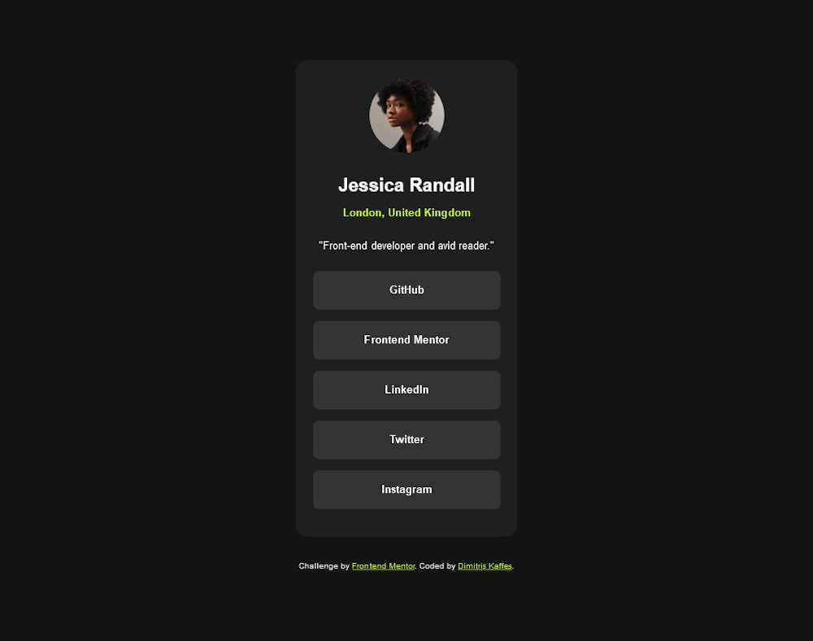

# Frontend Mentor - Social links profile solution

This is a solution from Dimitris Kaffes to the [Social links profile challenge on Frontend Mentor](https://www.frontendmentor.io/challenges/social-links-profile-UG32l9m6dQ).

## Table of contents

- [Overview](#overview)
  - [The challenge](#the-challenge)
  - [Screenshot](#screenshot)
  - [Links](#links)
- [My process](#my-process)
  - [Built with](#built-with)
  - [What I learned](#what-i-learned)
  - [Continued development](#continued-development)
  - [Useful resources](#useful-resources)
- [Author](#author)
- [Acknowledgments](#acknowledgments)

## Overview

A simple challenge without the need of a layout change between desktop and mobile view for the social links profile card.

A modern CSS reset (by Andy Bell) was implemented.

### The challenge

Users should be able to:

- See hover and focus states for all interactive elements on the page

### Screenshot

### Links

- Solution URL: [social-links-profile solution on Github](https://github.com/dkaffes/social-links-profile)
- Live Site URL: [social-links-profile live site](https://dkaffes.github.io/social-links-profile/)

## My process

The HTML was structured using semantic elements.

Custom properties were used for the colors and font-weights.

A container for the image and another container for the text were used inside the parent card container `div`.

The list of links was implemented with an unordered list with a column `display: flex`.

All the different active states (`:link`, `:visited`, `:focus`, `:hover`, `:active`) of the links got their distinct styling. The border on the `:focus` state was achieved using an inset `box-shadow`.

### Built with

- Semantic HTML5 markup
- CSS custom properties
- Flexbox
- Mobile-first workflow

### What I learned

Further practised:

- the embedding of local fonts.
- the centering of the card, using Flexbox.
- the call to action (cta) button styling.
- the implementation of the interactive elements active states, paying attention to their correct order in the stylesheet.

### Continued development

Study in more detail the Andy Bell's: A (more) Modern CSS Reset in more detail.

### Useful resources

- [A (more) Modern CSS Reset](https://piccalil.li/blog/a-more-modern-css-reset/) - This helped me include in my code the proposed (by many FED mentors) CSS reset.

## Author

- Frontend Mentor - [@dkaffes](https://www.frontendmentor.io/profile/dkaffes)

## Acknowledgments

Thanks to the developer [Andy Bell](https://piccalil.li/page/about/) for his CSS Reset.
